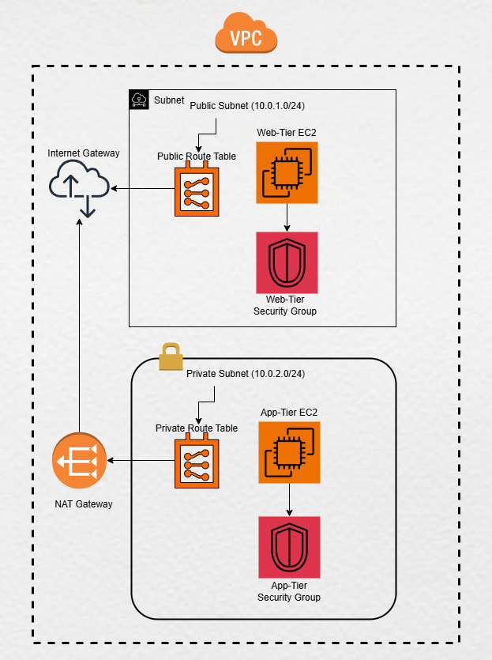

# Delivery Outcomes for Terraform + LocalStack 3-Tier Application

This document showcases the successful execution of the Terraform project, including logs, screenshots, and command outcomes.

---

## Delivery Outcome

### 1. **VPC and Related Resources**

**Requirement**: Create a VPC with valid CIDR block, containing all VPC-related resources such as valid subnets, route tables (public, private), security groups, NAT gateway, and Internet Gateway.

**Status**: ✅ Delivered

**Explanation**:

- A VPC with CIDR block `10.0.0.0/16` was created successfully.
- Public and private subnets were created:
  - Public Subnet CIDR: `10.0.1.0/24`
  - Private Subnet CIDR: `10.0.2.0/24`
- Routing resources:
  - Internet Gateway (IGW) was attached to the public subnet.
  - NAT Gateway was created and associated with the private subnet.
  - Route tables were configured for proper traffic routing.
- Security groups were created for both tiers (web and application).

**Evidence**:

#### Logs:

- Terraform Output:
  aws_vpc.main: Creation complete after 2s [id=vpc-690f2d77]
  aws_subnet.public: Creation complete after 10s [id=subnet-9933ff6f]
  aws_subnet.private: Creation complete after 0s [id=subnet-1ff5ed6e]
  aws_route_table.public_rt: Creation complete after 0s [id=rtb-d711f8a4]
  aws_route_table.private_rt: Creation complete after 0s [id=rtb-50f5a2d4]
  aws_nat_gateway.nat: Creation complete after 0s [id=nat-5c5a7c19d2a287acf]

#### Docker Logs:

- LocalStack API calls:
  2024-11-15T12:56:15.458 INFO --- AWS ec2.CreateVpc => 200
  2024-11-15T12:56:15.561 INFO --- AWS ec2.CreateSubnet => 200
  2024-11-15T12:56:15.551 INFO --- AWS ec2.CreateInternetGateway => 200
  2024-11-15T12:56:25.643 INFO --- AWS ec2.CreateNatGateway => 200
  2024-11-15T12:56:25.727 INFO --- AWS ec2.CreateRouteTable => 200

### 2. EC2 Instances for Web-Tier and Application-Tier

**Requirement**: Create EC2 servers for application-tier and web-tier.

**Status**: ✅ Delivered

**Explanation**:

- One EC2 instance for the web-tier and one for the application-tier were created in the respective subnets:
  - Web-tier instance in the public subnet.
  - Application-tier instance in the private subnet.
  - Instance details were configured as per the Terraform code.

**Evidence**:

- Terraform Output:
  app_instance_id = "i-5b268417b8512f58e"
  web_instance_public_ip = "54.214.72.97"

#### Logs:

aws_instance.app_instance: Creation complete after 10s [id=i-5b268417b8512f58e]
aws_instance.web_instance: Creation complete after 10s [id=i-142e7574d0dd7fdf5]

### 3. Autoscaling Groups and ALB

**Requirement**: Enable autoscaling for web-tier and application-tier behind an ALB.

**Status**: ❌ Not Delivered

**Explanation**:

- Autoscaling and ALB resources were commented out in the Terraform code due to LocalStack limitations:
  - LocalStack does not support autoscaling groups and ALB in the free version.

### 4. RDS Instances for Data-Tier

**Requirement**: Create RDS instances for the data-tier.

**Status**: ❌ Not Delivered

**Explanation**:

- RDS was not implemented as it is not supported in the free version of LocalStack.

### 5. Security Groups and IAM Roles

**Requirement**: Proper security groups and IAM roles for secure communication between tiers.

**Status**: ✅❌ Partially Delivered

**Explanation**:

- Security groups were successfully created for:
  - Web-tier (allow HTTP access from all sources).
  - Application-tier (allow communication from web-tier security group).
- IAM roles were not implemented due to LocalStack's limited IAM support.

**Evidence**:

#### Logs:

2024-11-15T12:56:15.569 INFO --- AWS ec2.CreateSecurityGroup => 200

### 5. Architecture Diagram

**Requirement**: Architecture Diagram is proper referenced with configuration enabled via terraform or cloudformation.

**Evidence**:

