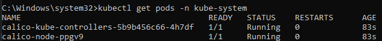
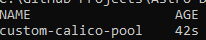
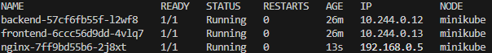

# Replace AWS VPC CNI with Calico in an EKS Cluster

### Introduction

This project demonstrates replacing the default AWS VPC CNI with Calico in an AWS EKS cluster. The setup includes a mixed node group (spot and on-demand), and a sample application to validate the configuration.

### Objectives

1. Replace AWS VPC CNI with Calico for networking.
2. Ensure Kubernetes system pods use AWS VPC IPs while application pods use Calico-assigned IPs.
3. Deploy a sample service to validate the networking layer.

### Prerequisites

- Minikube installed locally (used to simulate AWS EKS).
- `kubectl` CLI configured to interact with the Minikube cluster.
- Docker installed and running.

## 1. Start Minikube:

```bash
minikube start --driver=docker
```

## 2. Verify Minikube

```bash
minikube status
```

Output should confirm that Minikube is operational

## 3. Confirm Kubernetes Node

```bash
   kubectl get nodes
```

Output should show the Minikube node in the Ready state

## 4. Remove Default CNI

Remove the default CNI plugin to prepare for Calico installation:

```bash
   kubectl delete daemonset kube-proxy -n kube-system
```

Output should show "daemonset.apps "kube-proxy" deleted"

## 5. Install Calico

Apply the Calico manifest to deploy the networking layer:

```bash
   kubectl apply -f https://docs.projectcalico.org/manifests/calico.yaml
```

Command output should indicate that several Calico components and resources have been created successfully.

## 6. Verify Calico Installation

Check that the Calico components are running in the kube-system namespace:

```bash
   kubectl get pods -n kube-system
```

Expected output should show calico-node and calico-kube-controllers running:


## 7. Configure Calico IP Pool

### 1. Create a YAML file for the Calico IP pool, save the following content into a file named calico-ip-pool.yaml:

```yaml
apiVersion: crd.projectcalico.org/v1
kind: IPPool
metadata:
  name: custom-calico-pool
spec:
  cidr: 192.168.0.0/16
  ipipMode: Always
  natOutgoing: true
  disabled: false
```

### 2. Apply the YAML file: Use the following command to apply the IP pool configuration:

```bash
  kubectl apply -f calico-ip-pool.yaml
```

Output should show "ippool.crd.projectcalico.org/custom-calico-pool created"

### 3. Verify the IP pool: Check that the IP pool has been created successfully:

```bash
  kubectl get ippools
```

Expected output:


## 8. Deploy a Sample Application

## 1. Create an Nginx Deployment: Deploy a simple Nginx application:

```bash
  kubectl create deployment nginx --image=nginx
```

Output should show "deployment.apps/nginx created"

## 2. Expose the Nginx Deployment: Expose the deployment as a NodePort service so it can be accessed:

```bash
  kubectl expose deployment nginx --port=80 --type=NodePort
```

Output should show "service/nginx exposed"

## 3. Check the Application Pods: List the pods and their assigned IPs:

```bash
  kubectl get pods -o wide
```

Expected Output:


## Delivery Outcomes

You may view the [delivery_outcomes.md](./delivery_outcomes.md) file for the delivery outcomes of this assignment.
