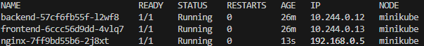

# Delivery Outcomes for Replacing AWS VPC CNI with Calico in Minikube Cluster

For this assignment, instead of using an actual AWS EKS cluster, I utilized Minikube to simulate an environment where the default AWS VPC CNI plugin is replaced by Calico for the networking layer. The objective was to replicate the core behavior of AWS VPC CNI, where Kubernetes system pods use AWS VPC IPs, while application pods use Calico-assigned IPs. This simulation aims to demonstrate how the Calico network overlay can replace the AWS VPC CNI in a Kubernetes cluster, with Minikube acting as the local cluster.

---

## Delivery Outcome

### 1. **Calico Installation in Minikube**

**Requirement**: Installed Calico networking layer in the kube-system namespace (pods: calico-kubecontroller, calico-node etc).

**Status**: ✅ Delivered

**Explanation**:

- Calico successfully installed in the Minikube cluster by applying the Calico manifest.
- The Calico components (calico-node and calico-kube-controllers) were deployed in the kube-system namespace.

**Evidence**:

### 2. **Application Pods Assigned IPs from Calico Pool**

**Requirement**: Kubernetes system pods should be running on private IPs from the Minikube default range, while application pods are assigned IPs from the custom Calico network (different IP range)

**Status**: ✅ Delivered

**Explanation**:

- The backend and frontend pods were created before the custom Calico IP pool was applied. As a result, they were assigned IPs from the default IPv4 pool (10.244.0.0/16).
- The nginx pod was deployed after the custom Calico pool (192.168.0.0/16) was created and applied. This demonstrates the successful allocation of an IP from the custom Calico pool.

**Evidence**:

- Backend pod (backend-57cf6fb55f-12wf8) IP: 10.244.0.12 (default IPv4 pool)
- Frontend pod (frontend-6ccc56d9dd-4vlq7) IP: 10.244.0.13 (default IPv4 pool)
- Nginx pod (nginx-7ff9bd55b6-2j8xt) IP: 192.168.0.5 (custom Calico pool)
